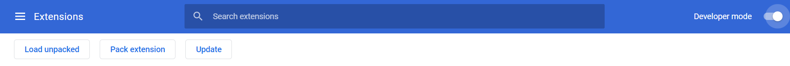
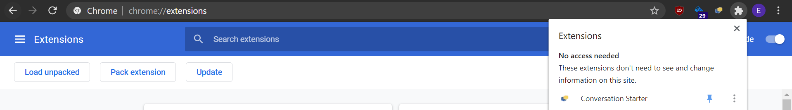

### Setup Instructions

Clone this repository with 
`git clone https://github.com/ericchen99/Convo-Chrome-Extension.git`

Navigate within the repository to find the `config.json` file. Update the contact information to your own.

Navigate to 
[chrome://extensions/](chrome://extensions/)

Check the developer tools icon in the top right corner of the screen

Click the `Load Unpacked` button and navigate to the repository you just cloned. Select the entire folder.

Enable the extension if it is not already. Pin the extension by navigating to your navbar and clicking the puzzle piece icon and then the pin.
